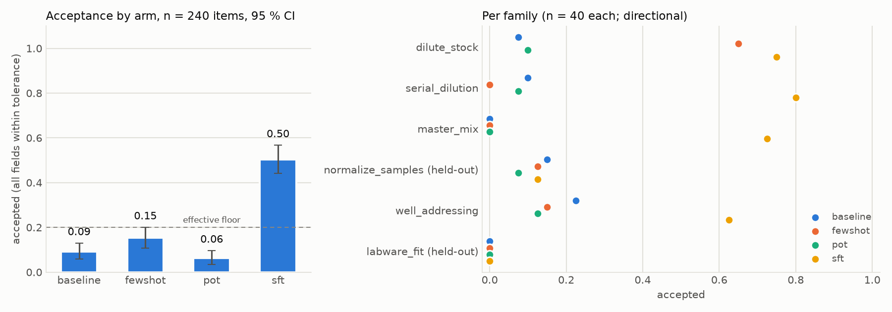
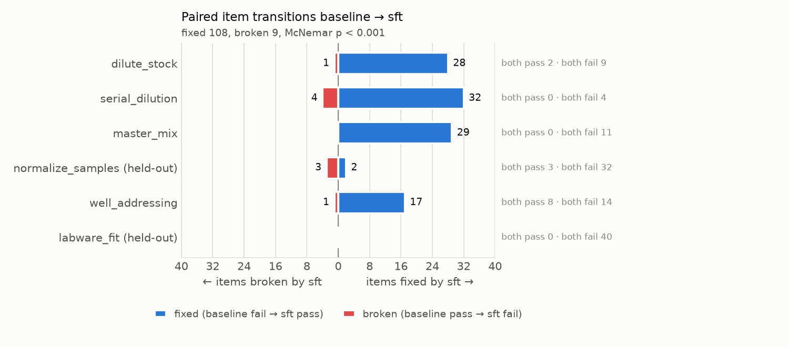
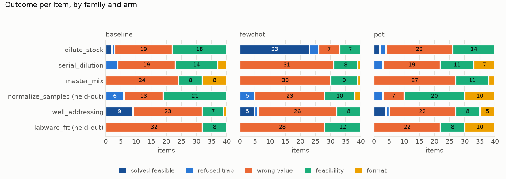
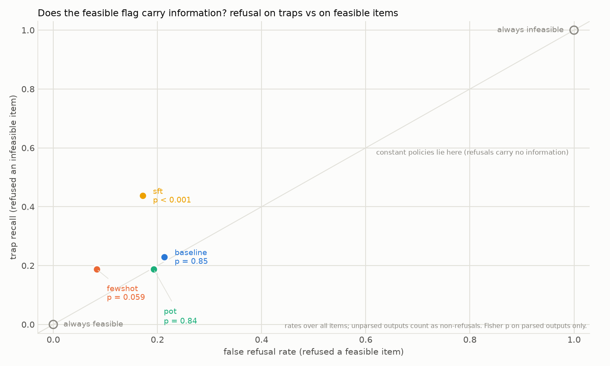

# Liquid-handling plan reasoning: an eval and an improvement scheme for a 1.5B model

**A liquid handler executes whatever numbers and well addresses the planner emits, so turning protocol intent
into volumes, wells and containers is a reasoning capability worth measuring. A 1.5B model scores 0.09 on it
zero-shot, and two prompting levers leave it under a 0.20 always-refuse floor; a 90-second LoRA on generated
traces lifts it to 0.50 overall and 0.73 on the four procedures it was shown, and transfers nothing to the two it
was not.**

This is a take-home demo of two skills: building an evaluation and improving a small model on it. It is not
a production eval. Everything runs in one free-tier Google Colab session (T4) in about 35 minutes, or as a
plain Python script on a CPU in smoke mode.

## Quick start

| | |
|---|---|
| Colab | open `notebook/prep_eval_colab.ipynb`, *Runtime → Change runtime type → T4 GPU*, *Run all* |
| GPU box, full run as a script | `uv sync --all-extras` (the lock resolves the PyPI torch, a CUDA 13 build; on a CUDA 12 driver follow with `uv pip install --python .venv "torch==2.14.1+cu126" --index-url https://download.pytorch.org/whl/cu126`), then `.venv/bin/python -u notebook/prep_eval_colab.py` (6 to 7 min on a 4090; a T4 is estimated at about 35 min, not yet measured; writes `results/`). RTX 40-series cards also need `NCCL_P2P_DISABLE=1 NCCL_IB_DISABLE=1`. Call scripts through `.venv/bin/python`: a plain `uv run` re-syncs the venv and would swap a cu126 torch back. |
| Build and tests (any box) | `uv sync --all-extras && .venv/bin/python -m pytest` |
| Smoke run (0.5B model, every code path and figure) | `PREPEVAL_SMOKE=1 .venv/bin/python notebook/prep_eval_colab.py` (minutes on a GPU, slow on CPU) |
| Rebuild the item files | `.venv/bin/python -m prepeval.dataset` (uses the committed `labware.json`; regenerate that with `.venv/bin/python -m prepeval.labware`, which needs the `plr` extra) |

## 1. The capability

**Reagent-prep and labware reasoning for liquid handling**: given a protocol intent in a scientist's words and
the facts of the bench (stock concentrations, container geometry, pipette limits, lab policies), produce the
exact volumes, concentrations, well lists and container choices a robot would execute, and recognise when the
request cannot be carried out as stated.

Why this one:

- It is the quantitative core of protocol automation: every `transfer`, `serial_dilute` and `normalize`
  step in a protocol compiler bottoms out in this arithmetic and this addressing.
- Small models fail it in characteristic ways (unit slips, inverted dilution factors, miscounted wells,
  "diluting" a sample that is already too dilute), so there is headroom and the failures are legible.
- No public dataset of wet-lab calculation problems with numeric ground truth exists (searched Hugging Face
  and the web; the nearest are college-chemistry sets such as SciBench and ChemistryQA, and LAB-Bench's
  ProtocolQA, which is troubleshooting multiple choice). A generated set is therefore the eval.

**Why a small model.** A frontier model would clear these items on first contact; the question is whether a model
small enough to live on the instrument can. Four reasons to want that: the planner can run on the instrument PC in
an air-gapped or GxP-controlled lab with no network dependency in the run loop; a protocol has hundreds of planning
steps per run and a fleet multiplies that, so each call has to be fast and nearly free; the weights are yours to
pin, hash into the run record, audit and fine-tune on your own operation set, with no vendor model drift between
validation and production; and protocols, reagents and sample metadata never leave the site. The price is
capability, which is what the eval measures and the fine-tune tries to buy back.

## 2. The eval

### Items

240 test items, six families × 40 seeds, generated deterministically by `prepeval/families.py`. Exactly every
fifth seed is an **infeasible trap** (20 %), so a model that always complies and one that always refuses both
fail. The four quantitative families have three intent phrasings each; `well_addressing` (four sub-tasks) and
`labware_fit` (three) vary by sub-task instead, so in-family gains there may partly reflect template familiarity.
The held-out families carry the generalisation claim.

| family | the model must produce | trap | ground truth |
|---|---|---|---|
| `dilute_stock` | stock µL and diluent µL for a target concentration and volume, across unit changes (mM→µM, mg/mL→ng/µL, X-fold) | target above stock; stock volume below the pipette minimum | arithmetic |
| `serial_dilution` | carry volume, diluent per well, discard from the last well, every well's concentration | wells would overflow | arithmetic + PyLabRobot well capacity |
| `master_mix` | per-component totals for N reactions with the stated excess, water to volume | recipe does not fit the reaction volume | arithmetic |
| `normalize_samples` **(held out)** | per-sample sample and diluent volumes to a common concentration and minimum volume | a sample already below target | outcome-graded arithmetic |
| `well_addressing` | expand `B2:D5`, well at column-major index k, the 8 wells under an 8-channel head, 96→384 interleaved-quadrant destination | off-plate addresses | **PyLabRobot** |
| `labware_fit` **(held out)** | plate vs deep-well vs trough for a volume and channel pattern, plates needed, trough load including unreachable volume | nothing fits | **PyLabRobot** labware + arithmetic |

**Prompt rule.** The prompt states the intent; a `World:` block carries every number (stock concentrations,
container facts, pipette minimum, lab policies); grading owns the answer key. The lever is never named: no
prompt says "account for dead volume" or "check feasibility". The only affordance is the JSON schema printed
in the prompt, which includes `"feasible": true|false` as a report channel.

**Ground truth.** Labware facts (rows × columns, well maximum volume) and all well addressing come from
[PyLabRobot](https://github.com/PyLabRobot/pylabrobot) at a pinned commit (`labware.json` caches them;
`tests/test_labware_plr.py` asserts every function agrees with the live PLR objects). The model never sees
PLR identifiers, only the facts. Trough "unreachable volume" is a stated lab policy, not a PLR number.

### Grading

Programmatic, no LLM judge (`prepeval/grading.py`). The last JSON object in the completion is extracted
(fenced, inline, or a Python dict literal; the last object carrying a `feasible` key wins). Volumes must be
within `max(0.05 µL, 1 %)`, concentrations and reaction counts within 1 %; counts exact; well lists exact as
sets (`A01` ≡ `A1`, a range such as `A5:H5` is expanded); container choice exact. An item is
**accepted** only if every required field passes. For infeasible items only the `feasible` flag is graded: a
specific refusal scores 1, acting anyway scores 0. Refusing a feasible item is a `feasibility` error. For
`normalize_samples` any (sample, diluent) pair that reaches the target within tolerance, meets the minimum
volume, respects the available volume and keeps the sample volume at or above the pipette minimum passes (any
correct construction is accepted). Every failure is classed as `format`, `feasibility` or `wrong_value`.

### Controls (run before any model call, in `pytest` and in the notebook)

| control | expected |
|---|---|
| gold answers graded | 100 % accepted |
| each gold corrupted one field at a time (+3 % beyond tolerance, ×1000 unit slip, flipped flag, dropped well) | 100 % rejected |
| a *program* that prints the gold, through sandbox → extractor → grader | 100 % accepted |
| constant policy "always feasible, zeros" | ≈ 0 |
| constant policy "always infeasible" | = trap share (0.20) |
| leak check at build time | no test prompt in train; held-out families absent from train; no non-trivial gold value printed in its own prompt except values given by construction that must be recognised rather than derived (a series' final volume and top concentration, the 2-fold carry, well counts) — any other collision is resampled; no few-shot value in a test gold |

The strongest non-solving control is the **effective floor**; arms are also reported as position above it.

### Statistics

Acceptance per arm with a 95 % bootstrap CI (10 000 resamples); paired delta against the baseline with its
bootstrap CI and an exact McNemar test on discordant pairs; per-family acceptance (n = 40 each, directional)
with held-out families marked; trap recall and false-refusal rate; format-failure rate; seconds per item.
Decoding is greedy (`pass@1`) with one shared `GenerationConfig` (no repetition penalty); token budgets are 512
new tokens for baseline, few-shot and sft and 320 for PoT, which is also prefilled with the opening code fence
and stopped at the closing one. Sandbox outcomes (timeout,
rejected import, runtime error) and token-cap hits are recorded per item so they can be told apart from
reasoning failures. Readings derived from the raw outputs (share of outputs with working before the JSON,
refusal rates on traps against feasible items with a Fisher exact test, accepted items split into solved
items and trap refusals, held-out acceptance split the same way, few-shot wins by family, PoT sandbox status
against cap hits) are computed by `prepeval/readings.py`, written to `results.json` under `summary.readings`,
and rendered as the notebook's narrative so the text describes the run that produced it.

## 3. The improvement scheme

Four arms on the same items, the same greedy `GenerationConfig` and the same model (`Qwen/Qwen2.5-1.5B-Instruct`,
Apache-2.0, fp16); token budgets 512 / 512 / 320 / 512.

| arm | what changes | why it should help | what happened (reference run) |
|---|---|---|---|
| `baseline` | zero-shot: intent + world + schema; the model may reason as it likes and ends with the JSON | the reference: instruct models are expected to reason step by step | 0.092; all 240 outputs were bare JSON with no working |
| `fewshot` | two worked examples from the training families (a dilution and a well block) | a trace to imitate, and format compliance | 0.154; 24 of 25 item-level wins in the exemplar's family, level or behind the baseline in every other family |
| `pot` | Program-of-Thought: the model writes one Python block that prints the JSON; a subprocess sandbox executes it; text JSON is the fallback | arithmetic and well enumeration move into the interpreter; the model only has to set up the formula (PAL/PoT: GSM-Hard 23 → 61 for CoT → code) | 0.062; 24 programs truncated at the 320-token cap, 38 `true`/`false` NameErrors; the sandbox blocked nothing legitimate |
| `sft` | LoRA (r = 16, attention + MLP, one epoch = 179 steps at effective batch 8, 90 s on a 4090, ~6 min on a T4) on 1 431 generated items from four families (375 seeds each; 69 `well_addressing` items whose prompt duplicated a test prompt were dropped), each with a programmatic reasoning trace and the gold JSON; evaluated with the baseline prompt | teaches the procedures; the two held-out families separate learned procedure from template memorisation | 0.504; 100 of 128 feasible in-train items solved, 0 of 64 held-out; a second fit of the same recipe scored 0.463 |

The fine-tune is honest only because of the split: training seeds are disjoint from test seeds, no training
prompt equals a test prompt, and `normalize_samples` and `labware_fit` never appear in training. In-family
and held-out acceptance are reported separately.

## 4. Results

Reference run: RTX 4090, fp16, greedy, n = 240, with this repository's code and data; timed phases 5 min 29 s
(inference 3 min 59 s over the four arms, LoRA training 90 s), 6 min 20 s end to end on the shell clock.
Artefacts are committed under `results/reference/` (`results.json` with `summary.readings`, `raw_outputs.jsonl`,
`gpu_run_4090.log`, the figures). A second run on the same GPU (the previous notebook version, same items and
decoding) reproduced the three prompting arms exactly: identical acceptance, per-family and error-class counts.
The LoRA arm reproduced only at the aggregate level: two fits of the same recipe on the same data scored 0.463
and 0.504, both with mean training loss 0.074. No Colab T4 run has been made; one should land inside the
intervals below.

Headline (n = 240, greedy, Qwen2.5-1.5B-Instruct):

| arm | n | accepted | acc | 95% CI | in-train fams | held-out fams | trap recall | false refusal | format fail | Δ vs baseline [CI] | McNemar p |
|---|---|---|---|---|---|---|---|---|---|---|---|
| baseline | 240 | 22 | 0.092 | [0.058, 0.129] | 0.100 | 0.075 | 0.23 | 0.21 | 0.05 | — | — |
| fewshot | 240 | 37 | 0.154 | [0.108, 0.200] | 0.200 | 0.062 | 0.19 | 0.08 | 0.02 | +0.063 [+0.017, +0.108] | 0.017 |
| pot | 240 | 15 | 0.062 | [0.033, 0.096] | 0.075 | 0.037 | 0.19 | 0.19 | 0.14 | -0.029 [-0.071, +0.013] | 0.23 |
| sft | 240 | 121 | 0.504 | [0.442, 0.567] | 0.725 | 0.062 | 0.44 | 0.17 | 0.00 | +0.412 [+0.342, +0.483] | 1.1e-22 |

Per family (n = 40 each; directional):

| family | n | baseline | fewshot | pot | sft |
|---|---|---|---|---|---|
| dilute_stock | 40 | 0.07 (3/40) | 0.65 (26/40) | 0.10 (4/40) | 0.75 (30/40) |
| serial_dilution | 40 | 0.10 (4/40) | 0.00 (0/40) | 0.07 (3/40) | 0.80 (32/40) |
| master_mix | 40 | 0.00 (0/40) | 0.00 (0/40) | 0.00 (0/40) | 0.72 (29/40) |
| normalize_samples (held-out) | 40 | 0.15 (6/40) | 0.12 (5/40) | 0.07 (3/40) | 0.12 (5/40) |
| well_addressing | 40 | 0.23 (9/40) | 0.15 (6/40) | 0.12 (5/40) | 0.62 (25/40) |
| labware_fit (held-out) | 40 | 0.00 (0/40) | 0.00 (0/40) | 0.00 (0/40) | 0.00 (0/40) |

Controls on the run: gold accepted 1.000; 1 125 single-field corruptions rejected 1.000; gold program through the
sandbox 1.000; always-feasible 0.000; always-infeasible 0.200; leak check pass; effective floor 0.200. Margin over
the floor (acc − 0.200): baseline −0.108, fewshot −0.046, pot −0.138, sft +0.304; normalised to the headroom
above the floor, (acc − 0.200)/0.800: −0.135, −0.057, −0.172, +0.380.









What the numbers mean. Each statement below is recomputed from `raw_outputs.jsonl` by `prepeval/readings.py` and
stored in `results.json`; the notebook prints the same sentences for whatever run it executes.

- All 240 baseline outputs are a bare JSON object with no working before it; the baseline is a direct-answer
  arm. Its 22 accepted items are 11 solved feasible items (6 % of 192) and 11 trap refusals.
- For baseline and PoT the `feasible` flag carries no information: refusal rates on traps and on feasible items
  are the same (11/46 vs 41/182, Fisher p = 0.85; 9/44 vs 37/162, p = 0.84). Forcing `feasible = true` on every
  prediction gives 0.046 and 0.025, and no refused feasible item carried correct values. That is why both sit
  under the 0.200 always-refuse floor. SFT's flag does carry information (21/48 vs 33/192, p < 0.001).
- Few-shot's +0.063 is 24 of 25 item-level wins in `dilute_stock`, the family of the dilution exemplar. Outside
  the two exemplar families (n = 160) few-shot is behind the baseline (5 vs 10 accepted, exact p = 0.062). On the
  previous item set, built with a different dilution exemplar, few-shot was 0.046 below the baseline; that build
  also changed the items, so exemplar sensitivity is the likely reading but has not been isolated.
- PoT ran at 320 tokens against 512 for the other arms and hit its cap on 30 items. All 24 rejected programs are
  SyntaxErrors from the cap, 38 of 42 runtime errors are `true`/`false` written as JSON inside Python, and
  loosening the sandbox would not change the number.
- SFT solves 100 of 128 feasible items in the trained families where the baseline solved 11, and 0 of 64
  feasible held-out items. Every held-out acceptance in every arm is a trap refusal, so every arm is below the
  0.200 floor on the held-out families. SFT emits the right schema on 80 of 80 held-out items; the failure is
  content, not format. The held-out design separated procedure from template, and the answer was template.
- The LoRA is a single seed. A second fit of the same recipe on the same data scored 0.463 [0.400, 0.525]
  against 0.504 [0.442, 0.567] here, with the same mean training loss; the aggregate CIs overlap and per-family
  cells move by several items. The 0.074 quoted as the training loss is the Trainer's mean over the epoch; the
  last logged step loss is 0.011.

Running `PREPEVAL_SMOKE=1 .venv/bin/python notebook/prep_eval_colab.py` writes `results/smoke-cpu.json` and the
`smoke-*.png` figures (0.5B model, 4 items per family, 3 LoRA steps) as a check that every code path and figure
executes; its numbers are not results.

## 5. What this does and does not show

- **Do not claim** that frontier models would struggle here. Items of this shape (documented facts plus a
  goal-level derivation) are the kind the top tier clears on first contact; the point is the gap between a
  small model and the ceiling, and how much of it two cheap interventions close.
- A scripted solver tops this eval by construction. That is precisely why tool use is a legitimate
  intervention: the model's job becomes setting up the right formula from scientist language and world facts.
- Per-family numbers at n = 40 carry ±15 pp; the n = 240 aggregate carries the claim.
- A pass means "the bookkeeping came out right", never "the assay would have worked".
- Items are generated, not real protocol text. The vocabulary and operation set mirror a protocol
  intermediate representation (transfer, serial dilute, normalise, master-mix assembly, dead volume, equal
  final volumes), but no real protocol was used.
- `feasible` in the schema is a deliberate affordance so a small model has a report channel at all; a stricter
  design would make infeasibility discoverable only from the world.
- The few-shot arm is probably exemplar-sensitive, but that has not been isolated: its result moved from −0.046 to
  +0.063 between two builds that swapped the dilution exemplar and regenerated the item set in the same commit.
  Within this run 24 of 25 wins sit in the exemplar's family. Average over exemplars on one item set before
  reading it as a capability effect.
- PoT was measured at a 320-token budget against 512 for the other arms; part of its deficit is the cap.
- The LoRA result is "teaches the procedures it is shown". No transfer to the held-out families was measured, and
  the adapter is a single seed: two fits of the same recipe on the same data scored 0.463 and 0.504.

## 6. Layout

```
prepeval/
  families.py    six seeded generators: prompt (intent + world + schema), gold, trace, grader spec
  labware.py     PyLabRobot wrappers + labware.json cache: catalogue, ranges, column-major index, quadrants
  grading.py     JSON extraction, per-field tolerance / set match, feasibility, error class, controls
  prompts.py     arm prompts (baseline, few-shot, PoT), SFT target
  sandbox.py     Program-of-Thought executor: subprocess, AST filter, builtins whitelist, 2 s timeout
  dataset.py     deterministic splits, leak checks, manifest
  stats.py       bootstrap CI, exact McNemar, per-family tables, results JSON
  readings.py    derived readings for the notebook's live narrative (bare-JSON share, refusal rates with Fisher exact,
                 held-out acceptance split into solved items and trap refusals, few-shot wins by family, PoT sandbox
                 outcomes against cap hits) and the Markdown renderers; stored in results.json under summary.readings
  figures.py     the eight notebook figures (acceptance, outcomes per family, refusal rates before and after
                 training, training lengths, loss curve, paired transitions, in-train vs held-out split); never
                 selects a backend
data/            test.jsonl (240), train.jsonl (1 431), fewshot.jsonl (2), manifest.json (seeds, sha256, PLR commit)
notebook/        prep_eval_colab.py (jupytext percent source) and the built .ipynb; the narrative cells hold the
                 story and the numbers in the text are computed from the run that is executing
tests/           hand-worked golds, grader controls, extraction cases, sandbox safety, PLR cross-check, leak checks,
                 notebook source/ipynb sync, readings on synthetic data, every figure on synthetic data
results/         written by runs and not committed, except results/reference/: the reference run's results.json,
                 raw_outputs.jsonl, run log and figures
```

Rebuild the notebook after editing the source: `.venv/bin/jupytext --to ipynb notebook/prep_eval_colab.py`
(`tests/test_notebook.py` fails when the two drift). To prove the figures render inline without Colab, install
`ipykernel nbclient` into the venv and execute the `.ipynb` headlessly in smoke mode with `nbclient`.

## 7. What I would do differently with more time

In the order they would change a conclusion above:

1. A zero-shot chain-of-thought baseline ("work step by step, then the JSON") so the reference arm reasons; on
   the reference run the baseline answered without working.
2. One token budget for every arm (at least 512) and `true`, `false`, `null` defined in the PoT runner, so no arm
   is measured against its cap or its spelling.
3. One infeasible few-shot exemplar, and few-shot reported across several exemplars on one item set; the
   current gain is confined to the exemplar's family and has not been separated from the item change.
4. A second LoRA seed, and a five-train / one-held-out rotation so transfer is tested per family rather than on
   two fixed families.
5. Grade by **replaying the model's plan** through PyLabRobot's volume trackers (a third-party bookkeeping
   oracle) instead of matching plan parameters, so any correct construction passes for every family.
6. Run a frontier reference arm to measure the ceiling instead of asserting it, and a GSM8K slice before and
   after the LoRA to show no general regression.
7. Add a small real-text split from CC-BY protocol recipe tables, hand-checked, as a distribution-shift probe.
8. Add a `maj@5` self-consistency arm over executed programs, and SFT + PoT together, once item 2 has made PoT a
   fair arm.
9. Make infeasibility discoverable from the world alone (drop the `feasible` key) and grade the refusal as a
   free-text report.

## References

LAB-Bench (Laurent et al., 2024) and LABBench2 (2026); Aviary (Narayanan et al., 2024: tools + fine-tuning took
Llama-3.1-8B from 1 % to frontier level on SeqQA); PAL (Gao et al., 2023) and Program-of-Thoughts (Chen et
al., 2023); "To CoT or not to CoT" (Sprague et al., 2025); GSM-Symbolic (Mirzadeh et al., 2024); "SFT
Memorizes, RL Generalizes" (Chu et al., 2025); "Adding Error Bars to Evals" (Miller, 2024); PyLabRobot
(Wierenga et al., 2023).
